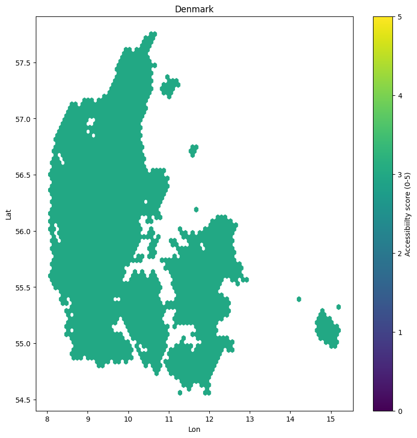
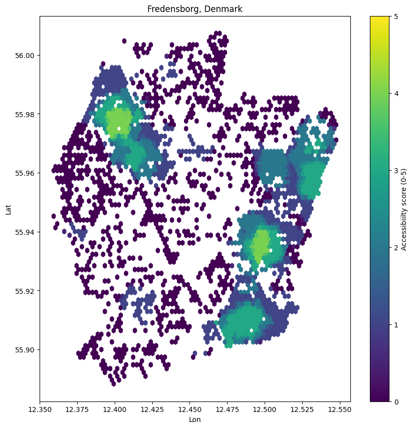
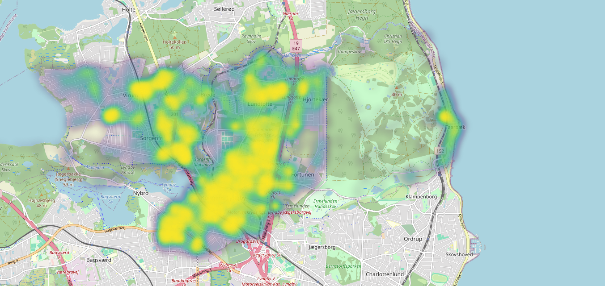
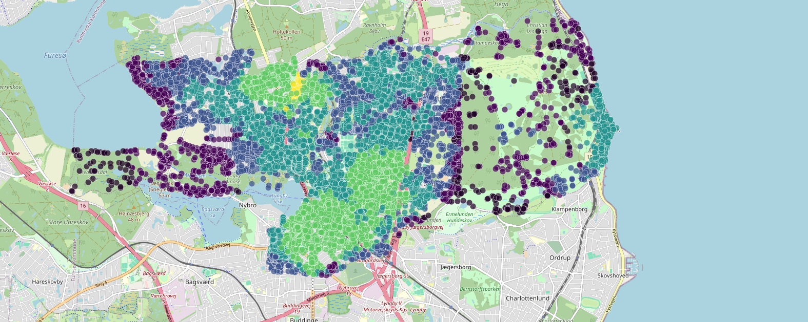

# Week 1: Progress overview

---

## Preprocessing - Network

- Reads the whole of Denmark as a `.pbf` with `osmium`
- Filters `highway` ways, builds nodes + edges
- Initializes pandana network

---

## Preprocessing - Output

- Able to extract each node's / area's tags on large scale OSM data (still in exploratory stage)
- Able to compute a simple accessibility score for each node based on nearest amenities (still in exploratory stage)
- Able to export features as JSON, containing OSM id, point data, and accessibility score for frontend use

---

---

## Preprocessing - Scoring

- Implemented a exploratory scoring system:
  - **4 km/h** walking speed
  - **15 min** travel time
  - Reachability threshold: ~1000 m
- Binary score for each category: within 1 km = 1, otherwise 0
- The final `access_score` is the sum of reachable categories per node

---

*Figure 1: Example of accessibility scoring a small city in Denmark*

---

## Frontend

- Set up Next.js project for visualizing our map
- Leaflet is used as interactive map
- Able to visualize accessibility data as both scatter and heatmap overlays (incridibly inperformant!)

---

---

